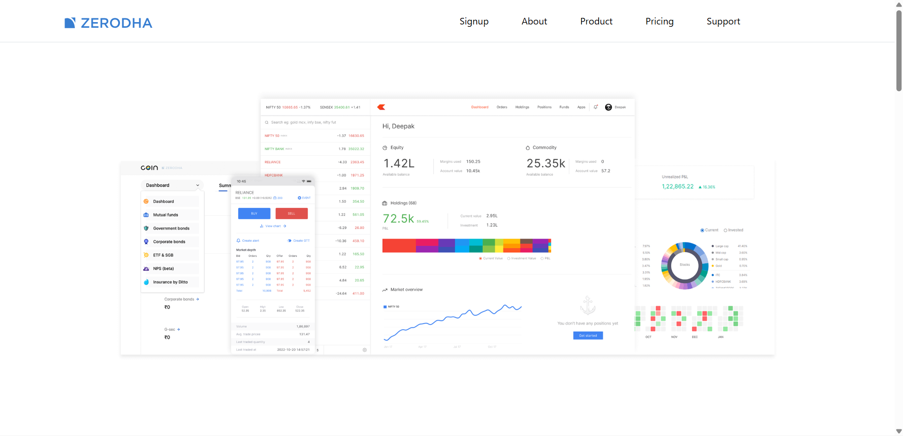
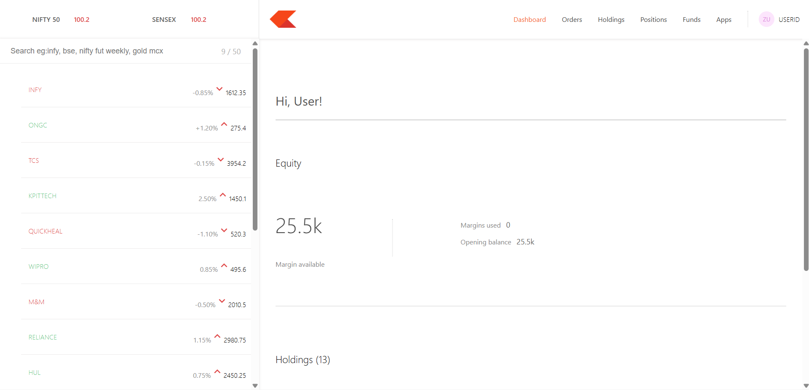
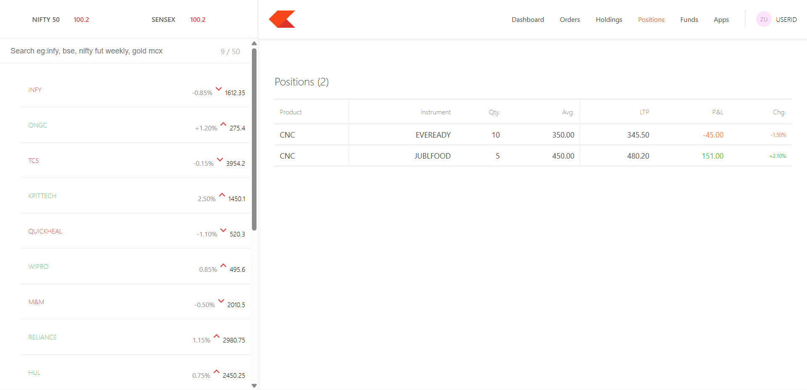

# Trading Platform Dashboard & Landing Page

## Overview
This project is a comprehensive full-stack stock trading platform that features a beautiful, dynamic landing page and a feature-rich user dashboard. It allows users to view their portfolio, track mock holdings and positions, and explore various financial products. The platform is designed with a modern, responsive UI and a robust backend API.

## Features
- **Dynamic Landing Page:** Beautiful, responsive UI built with React to showcase products, pricing, and company information.
- **Trading Dashboard:** An interactive dashboard that displays user equity, available margins, holdings, and positions with real-time-like data.
- **Portfolio Tracking:** Visual summaries of profit and loss (P&L), current investment values, and asset allocations.
- **Responsive Design:** Fully optimized for desktop, tablet, and mobile devices using Bootstrap and Material-UI.
- **RESTful API:** A backend service that supplies data to the frontend, complete with Mongoose schemas for Holdings, Positions, and Orders.

## System Architecture
The application follows a standard MERN stack architecture with a clear separation of concerns:
1. **Frontend Server:** Serves the static landing pages, marketing content, and signup flows.
2. **Dashboard Server:** A specialized Single Page Application (SPA) for authenticated users to view their trading data.
3. **Backend API:** An Express server that connects to MongoDB and provides RESTful endpoints for the dashboard and frontend.
4. **Database:** MongoDB is used to persist user orders, positions, and holdings.

## Tech Stack
- **Frontend & Dashboard:** React.js, React Router DOM, Bootstrap 5, Material-UI, Chart.js
- **Backend:** Node.js, Express.js, Mongoose, Passport.js (Authentication setup ready)
- **Database:** MongoDB
- **Development & Tooling:** Nodemon, Create React App

## Project Structure
```text
├── backend/          # Express API server & MongoDB schemas
│   ├── model/        # Mongoose models (Holdings, Orders, Positions)
│   ├── index.js      # Main server entry point
│   └── package.json  # Backend dependencies
├── dashboard/        # React SPA for the trading dashboard
│   ├── public/       # Public assets
│   ├── src/          # React components and mock data (data.js)
│   └── package.json  # Dashboard dependencies
├── frontend/         # React SPA for the public landing pages
│   ├── public/       # Public assets (media/images)
│   ├── src/          # React components for Home, About, Pricing, etc.
│   └── package.json  # Frontend dependencies
└── docs/
    └── results/      # Screenshot previews of the application
```

## How It Works
1. The **Frontend** runs on port `3000` and serves the public-facing pages such as Home, About, Product, Pricing, Support, and Signup.
2. The **Dashboard** runs on port `3001` and simulates a logged-in user experience. It consumes mock data for immediate UI rendering while also having the capability to fetch live data from the backend.
3. The **Backend** runs on port `3002`, connects to the local MongoDB instance, and exposes endpoints like `/allHoldings` and `/newOrder` to process trading logic.

## Results
Here are the visual results of the completed project:







## Installation

### Prerequisites
- Node.js installed
- MongoDB installed and running locally

### Steps
1. **Clone the repository** (or download the source code).
2. **Start the Database:** Ensure MongoDB is running on your system (e.g., `mongod`).
3. **Run the Backend:**
   ```bash
   cd backend
   npm install
   npm start
   ```
4. **Run the Dashboard:**
   ```bash
   cd dashboard
   npm install
   # On Windows PowerShell
   $env:PORT=3001; npm start
   ```
5. **Run the Frontend:**
   ```bash
   cd frontend
   npm install
   npm start
   ```
6. **Access the Apps:**
   - Frontend: `http://localhost:3000`
   - Dashboard: `http://localhost:3001`

## Future Improvements
- **Complete Authentication:** Fully implement the Passport.js logic to secure the dashboard behind a login wall.
- **Live Market Data:** Integrate a third-party stock market API (like AlphaVantage or Yahoo Finance) to replace the mock data with real-time stock prices.
- **Order Execution Engine:** Build out the backend logic to match buy/sell orders and simulate a real exchange environment.
- **Dark Mode:** Implement a system-wide dark mode toggle for both the landing page and the trading dashboard.
